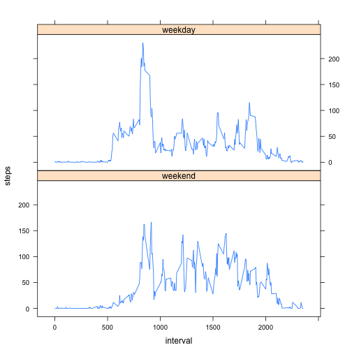

### Loading and preprocessing the data


```r
data<-read.csv("/Users/lixinyan/Documents/r/rdata/activity.csv")
```

```
## Warning in file(file, "rt"): cannot open file
## '/Users/lixinyan/Documents/r/rdata/activity.csv': No such file or
## directory
```

```
## Error in file(file, "rt"): cannot open the connection
```

### What is the mean of total number of steps taken per day?

1. Make a histogram of the total number of steps taken each day


```r
data2<-aggregate(steps~date,data=data,sum)
hist(data2$steps,xlab="steps",main="steps taken each day")
```

 

2. Calculate and report the mean and median total number of steps taken per day


```r
meandata<-round(mean(data2$steps),2)
mediandata<-median(data2$steps)
```

The result is:


```r
meandata
```

```
## [1] 10766.19
```

```r
mediandata
```

```
## [1] 10765
```

The mean of total numbers of steps taken each day is 1.076619 &times; 10<sup>4</sup>. The median of total numbers of steps taken each day is 10765. 

### What is the average daily activity pattern?

1. Make a time series plot (i.e. type = "l") of the 5-minute interval (x-axis) and the average number of steps taken, averaged across all days (y-axis)


```r
data3<-aggregate(steps~interval,data=data,FUN=mean)
plot(data3$interval,data3$steps,type="l",xlab="interval",ylab="steps",main="average steps taken in each interval")
```

 

2. Which 5-minute interval, on average across all the days in the dataset, contains the maximum number of steps?


```r
maxinterval<-data3[(data3$steps==max(data3$steps)),]$interval
maxinterval
```

```
## [1] 835
```
The required interval is 835.

### Imputing missing values
1. Calculate and report the total number of missing values in the dataset (i.e. the total number of rows with NAs)


```r
NAnum<-sum(is.na(data))
NAnum
```

```
## [1] 2304
```

The total number of missing values in the dataset is 2304.

2.Devise a strategy for filling in all of the missing values in the dataset. The strategy does not need to be sophisticated. For example, you could use the mean/median for that day, or the mean for that 5-minute interval, etc.


```r
n1<-nrow(data)
n2<-nrow(data3)
i=1
datanew<-data
for (i in 1:n1){j=1
  if (is.na(datanew[i,1])){
    intervalmatch<-datanew[i,3]
    for(j in 1:n2){
      if(data3[j,1]==intervalmatch){
        datanew[i,1]<-data3[j,2]
        break
      }
    }
  }
}
```

3. Create a new dataset that is equal to the original dataset but with the missing data filled in.

The dataset is alread made in the last question.

4. Make a histogram of the total number of steps taken each day and Calculate and report the mean and median total number of steps taken per day. Do these values differ from the estimates from the first part of the assignment? What is the impact of imputing missing data on the estimates of the total daily number of steps?


```r
datanew2<-aggregate(steps~date,data=datanew,sum)
hist(datanew2$steps,xlab="steps",main="steps taken each day")
```

 

```r
meannew<-mean(datanew2$steps)
meannew
```

```
## [1] 10766.19
```

```r
mediannew<-median(datanew2$steps)
mediannew
```

```
## [1] 10766.19
```

Previously, the mean and median is 1.076619 &times; 10<sup>4</sup> and 10765 respectively. Comparing those two results, the mean is the same no matter whether there are missing values or not. The median increases if there is no missing value.

The estimates of total daily number of steps is the mean of total number of steps taken per day. Thus if there is no missing data, the the estimate will also change. We got the same result for the mean just because of the method we use to fill in all the missing values.

### Are there differences in activity patterns between weekdays and weekends?

1. Create a new factor variable in the dataset with two levels – “weekday” and “weekend” indicating whether a given date is a weekday or weekend day.


```r
datanew$date<-as.Date(datanew$date)
datanew$weekday<-weekdays(datanew$date)
datanew3<-datanew
n3<-nrow(datanew)
for(i in 1:n3){
  if((datanew$weekday[i]!="Sunday")&(datanew$weekday[i]!="Saturday")){
    datanew$weekday[i]<-1
  }else{
    datanew$weekday[i]<-0
  }
}
datanew5<-datanew
datanew$weekday<-factor(datanew$weekday,labels=c("weekend","weekday"))
```

2. Make a panel plot containing a time series plot (i.e. type = "l") of the 5-minute interval (x-axis) and the average number of steps taken, averaged across all weekday days or weekend days (y-axis). See the README file in the GitHub repository to see an example of what this plot should look like using simulated data.


```r
datanew6<-aggregate(steps~interval+weekday,data=datanew,FUN=mean)
library(lattice)
xyplot(steps~interval|weekday,data=datanew6,layout=c(1,2),type="l")
```

 


